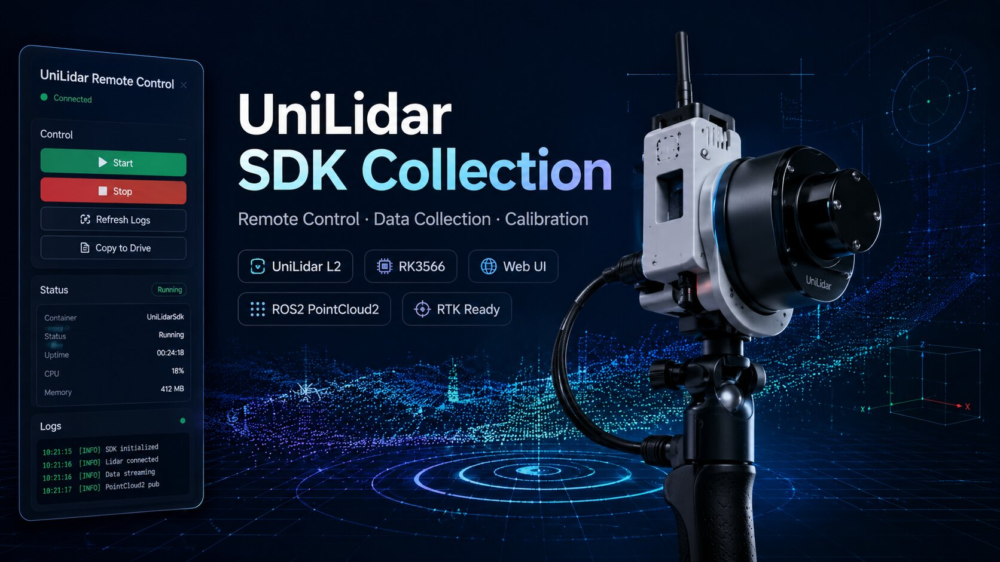
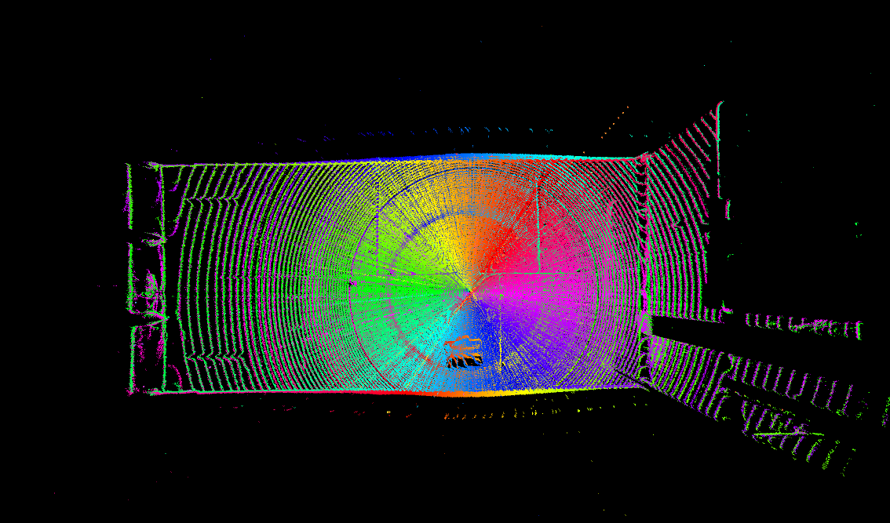
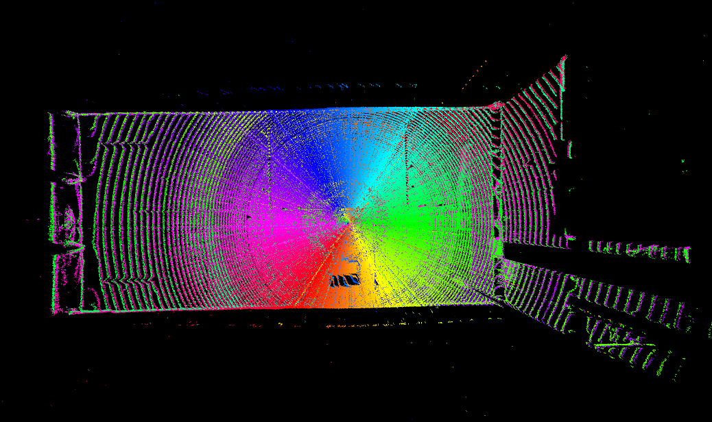
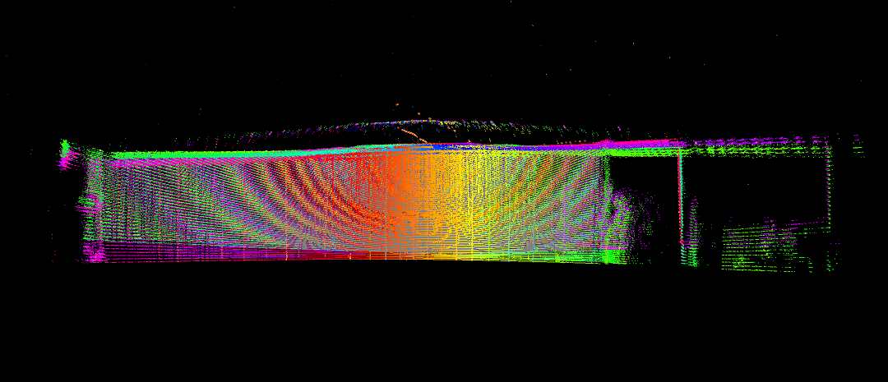
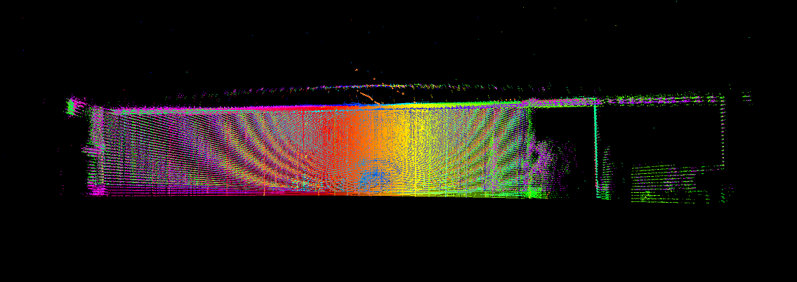

# Unitree Lidar Collector



* RK3566 for data collection.
* UniLidar L2 for pointcloud.
* 3D print box : https://www.tinkercad.com/things/cM7BuANyys1-unilidar-box


## How to use

1. prepare the environment
```bash
mkdir -p ~/work
cd ~/work
git clone https://github.com/MapMindAI/unilidar_sdk2_bazel.git
sudo bash unilidar_sdk2_bazel/setup.sh
```

2. then go to web `http://<device-ip>:8080/`

## Setup

`setup.sh` is a one-shot installer that must be run as root. It calls each tool script in order:

| Step | Script | What it does |
|------|--------|--------------|
| 1 | `tools/setup_unilidar_sudo.sh` | Adds user to `dialout` group (serial port access without `sudo chmod`), installs `/etc/sudoers.d/unilidar` with passwordless rules for CPU freq writes |
| 2 | `tools/set_cpu_freq_max.sh` | Sets all CPU policies to max performance governor, then prints current freq via `tools/check_current_cpu_freq.sh` to confirm |
| 3 | `docker_compose/boot_app/enable_unilidar_web_boot.sh` | Writes the systemd unit, creates `/etc/unilidar/rtk.env` if absent, enables and starts `unilidar-web.service` |

> Re-login or reboot after first run so the `dialout` group membership takes effect.

## Unitree Lidar SDK

This repo provides:

- the vendor SDK headers and prebuilt libraries under `include/` and `lib/`
- example programs under `examples/`
- a ROS 2 bridge node in [unitree_lidar_rosnode.cc](/unitree_lidar_rosnode.cc)
- a lightweight remote control webserver in `docker_compose/unilidar_mapping/webserver.py`
- offline calibration tools under `unitree_lidar_sdk/calibration/`

## Highlight: Custom Packet-to-`PointCloud2` Conversion

`unitree_lidar_rosnode` reads Unitree lidar data from the SDK and publishes:

- `/unilidar/imu` as `sensor_msgs::msg::Imu`
- `/unilidar/cloud` as `sensor_msgs::msg::PointCloud2`

The node supports two cloud-generation paths:

1. `--use_sdk_pointcloud=true`
   Uses `UnitreeLidarReader::getPointCloud(PointCloudUnitree&)` and converts the SDK cloud directly into ROS `PointCloud2`.

2. `--use_sdk_pointcloud=false`
   Uses raw `LidarPointDataPacket` packets and builds `PointCloud2` manually inside `BuildCloudMessage(...)`.

<details>
<summary>Custom Packet-to-<code>PointCloud2</code> Conversion</summary>

The custom path is implemented in `BuildCloudMessage(const LidarPointDataPacket&, ...)`.

What it does:

- allocates a fixed `PointCloud2` layout with:
  - `x` at offset `0`
  - `y` at offset `4`
  - `z` at offset `8`
  - `intensity` at offset `16`
  - `ring` at offset `20`
  - `time` at offset `24`
- reads raw ranges and intensities from each Unitree packet
- applies the Unitree calibration parameters
- converts each sample to 3D XYZ
- accumulates multiple single-ring packets into one ROS cloud when `--cloud_accumulate_rings > 1`

This path exists so the project can control:

- exact field layout expected by downstream code
- ring accumulation behavior
- per-point relative timing
- timestamp policy when `--use_system_timestamp` is enabled
</details>

## Highlight: Calibration

Offline calibration tools live under [`unitree_lidar_sdk/calibration/`](/unitree_lidar_sdk/calibration), and the full workflow is documented in [`unitree_lidar_sdk/README_calibrate.md`](/unitree_lidar_sdk/README_calibrate.md).

- `unitree_lidar_packet_auto_calibrator`: extracts planes from merged point clouds, evaluates point-to-plane residuals, and searches calibration parameters automatically
- `unitree_lidar_packet_manual_calibrator`: opens the same replay viewer with manual calibration parameters for visual inspection and tuning

**Current Issue**: the automatic calibration still does not give an ideal result.
I currently use manual adjustment in `unitree_lidar_packet_replayer`: load recorded packets,
apply hand-tuned correction factors during decode, rebuild the merged cloud, and inspect the
result in Pangolin until the geometry looks consistent.

| view | before | after |
|---|---|---|
| top view |  |  |
| side view |  |  |


## Highlight: Remote Web Control

This repo includes a small Python webserver for remote control of the UniLidar Docker stack.

| Section | Controls |
|---------|----------|
| **Calibration Parameters** | Edit and save `alpha_bais_bias`, `range_fix_a0`, `range_fix_a1` into the compose file |
| **Recorder Bag Name** | Set optional bag name postfix |
| **Container Status** | Running / Stopped indicator, container and compose file info |
| **Start / Stop / Logs** | Launch or stop the stack, switch live logs between `UniLidarSdk`, `Recorder`, `RtkPublisher` |
| **Tools** | Copy to Drive · List Topics · Check CPU Freq · Set CPU Max — all output to one shared pane (click title to collapse) |

Optional environment variables:

- `UNILIDAR_WEB_HOST` default `0.0.0.0`
- `UNILIDAR_WEB_PORT` default `8080`
- `UNILIDAR_COMPOSE_NAME` default `unilidar_collection`
- `UNILIDAR_CONTAINER_NAME` default `UniLidarSdk`

When running from the boot service, RTK compose variables are loaded from
`/etc/unilidar/rtk.env`, not from `~/.bashrc`.

<details>
<summary>Enable At Boot</summary>

This repo includes a `systemd` installer script for the target device. The
installer writes `/etc/systemd/system/unilidar-web.service` using the repo path
where you run the script, so rerun it after moving or recloning the repo.

Install and enable the webserver on boot:

```bash
sudo bash docker_compose/boot_app/enable_unilidar_web_boot.sh
```

This writes:

- `/etc/systemd/system/unilidar-web.service`
- `/etc/unilidar/rtk.env` if it does not already exist

Then it runs:

- `systemctl daemon-reload`
- `systemctl enable unilidar-web.service`
- `systemctl restart unilidar-web.service`

See logs with `sudo journalctl -u unilidar-web.service -b`.
</details>

## Highlight: RTK GNSS

See [`README_RTK.md`](README_RTK.md) for full hardware specs and background on the WTRTK-960H module.
